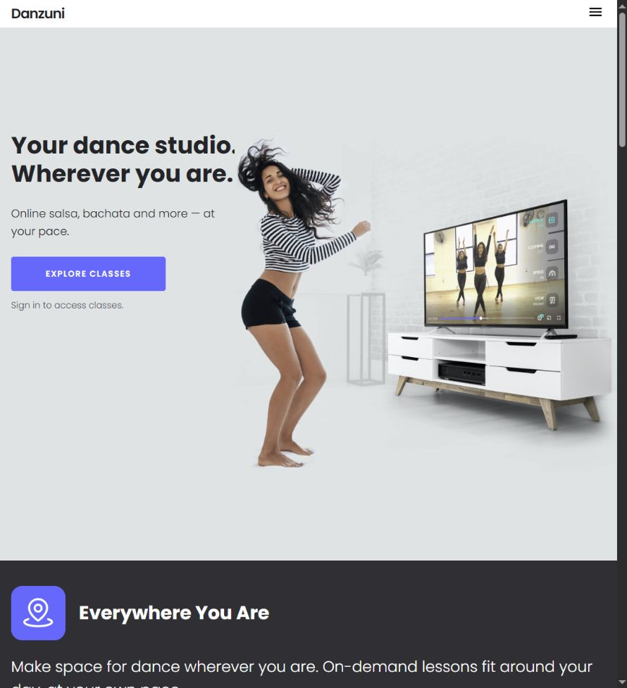
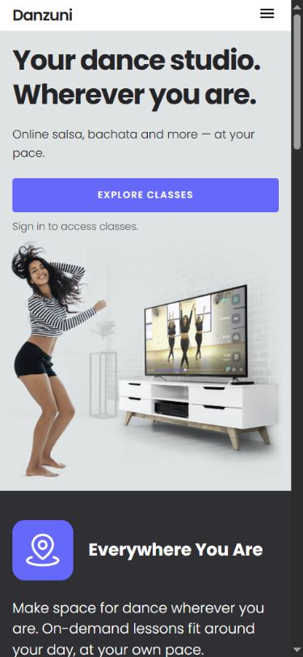
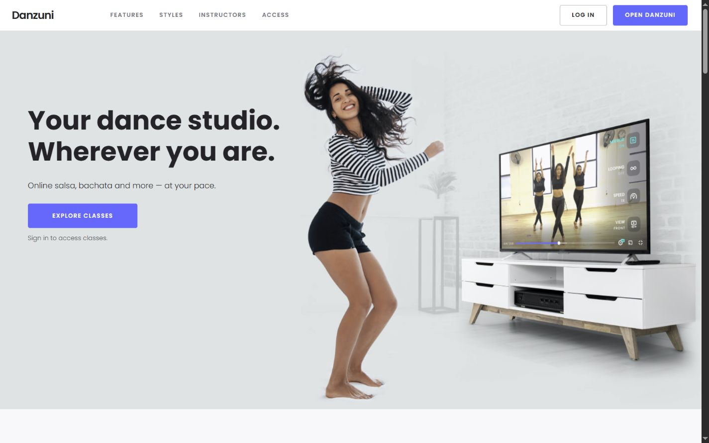
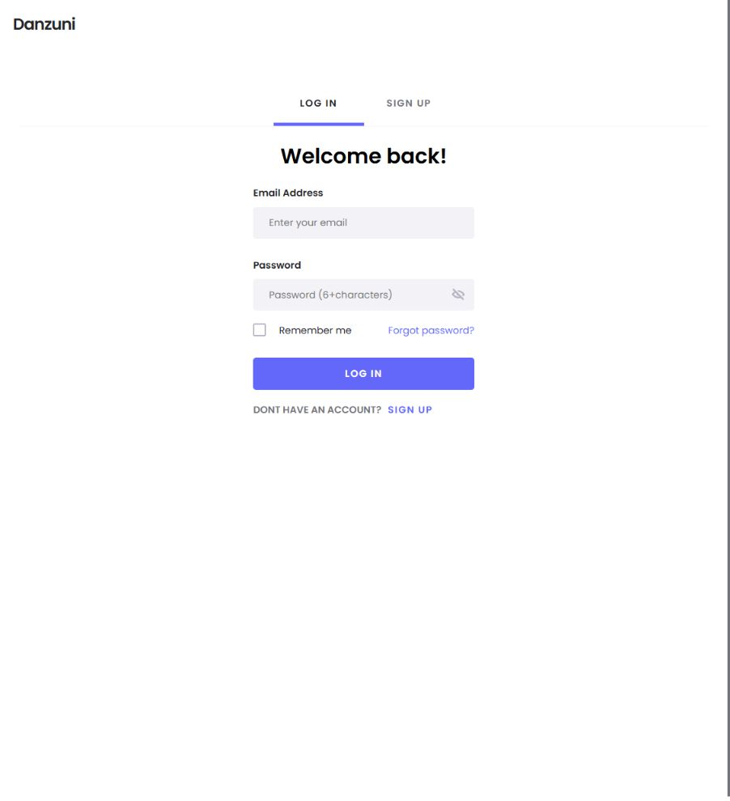

# Danzuni V1 hero — current-state audit, 2026-09-09

Read-only audit of the hero shown in the owner's screenshot, not the access section implied by the ambient #pricing URL. Current live browser supplied all evidence. No source/site/provider changes, commits, pushes, submissions or deployments. Audit notes and captures are local uncommitted work and must be retained with this worktree.

## Steps and health

1. Hero at current intermediate viewport: NEEDS CORRECTION. CSS viewport 906×994, DPR1.25, hero width890.4 and height769. Screenshot pixels are not CSS pixels. Top padding150; bottom203; title y189.8, x16, width343.35, font34/40.8; CTA223×49.6 at y370.6. Large empty top band and crowded text/photo boundary confirmed visually. Fixed geometry, not absence of golden ratio, is the actionable issue.
2. Same hero at narrow mobile390×844: BETTER composition. Hero590.9px high, title starts54.8; full-width CTA343.2×44 at y228.9. Document375≤390, no sampled horizontal overflow. Image is below text. Do not apply the intermediate desktop reduction globally to this working mobile stack.
3. Same hero at wide desktop1440×900: BETTER separation but weak balance. Hero still769px high, title212.4/height127.85; CTA223×49.6. Image is materially larger than the text/action group; visual attention claim is art-direction judgment, not an eye-tracking result.
4. Click the actual hero Explore classes link: MAJOR ACQUISITION FRICTION. Browser goes from https://go.danzuni.com/v1 to https://app.danzuni.com/login, showing Welcome back!, empty email/password fields, Log in and Sign up. No credentials entered. Visible sign-in note warns of authentication, but Explore classes suggests discovery while the next page serves a returning account. Signup and purchase were not tested; do not infer that they work or are broken.

## Captures

## Findings and minimal corrections

- Priority1: Define the hero's immediate user goal. For the currently gated destination, use an honest Open Danzuni / Sign in CTA. For cold acquisition, the better product path is real course discovery or a real lesson excerpt before authentication, but that is a separate capability requiring authorization and functioning content, not a wording trick. Do not label a login link Watch a lesson.
- Priority1: Replace conflicting desktop percentages with real text/image areas and a guaranteed gutter. Under current CSS at intermediate hero width890.4, image62% area starts338.35 while title box ends359.35: approximately21px rectangle overlap. This is not proof that every glyph is obscured, but it explains the crowding and overlay risk. At wide desktop, contain-centering creates enough incidental clearance to mask the problem.
- Priority1: State concretely what the visitor receives. Existing headline is emotional and readable, not worthless; the supporting sentence names styles and flexible timing but not the access model or scope. Prefer a concise factual description of on-demand lessons, supported by a real verifiable course/teacher/example. Do not invent catalog numbers, languages, pricing or availability. Language advantage is not ready-to-claim merely from strategy.
- Priority2: Reduce fixed upper dead space and rebalance hero height at intermediate desktop widths. Trial target 64–88px top spacing rather than150, gap24–40px, with an image crop/scale that preserves dancer and TV. These are proposed starting values, not validated final measurements. Simple height reduction without repositioning absolute photo can clip the dancer.
- Priority2: Group heading, descriptive sentence, CTA and sign-in explanation more tightly; improve supporting text prominence. Keep the CTA single and contrastful, with enough visual weight beside the photograph. Do not enlarge every element or add cards/trust-logo rows.
- Priority2: Keep the existing photo's useful story: a real person dancing at home with a lesson on a screen. The scene already communicates dance-anywhere. Reduce the furniture/TV's relative dominance through measured crop/placement only if the message remains intact. Do not introduce an unrelated premium-looking photo or motion to disguise broken hierarchy.
- Secondary: At current intermediate width the hamburger hides Log in, while the main hero action also leads to login. Separate returning-account navigation from discovery intent when a genuine discovery route exists. Avoid multiplying CTA buttons with identical destinations.

Golden ratio is not an acceptance criterion. The existing photo area is already62%, approximately the familiar61.8%; that does not provide a safe gutter, sensible vertical spacing, offer clarity or a successful next step.

## CSS grounding

Current served artifact: D:/codex-runs/danzuni-complete-v1-20260909/release/v1/css/style.css (minified line1), clarity.css lines around36. Desktop hero structure starts800px, full header nav950px, photo right shift1354px; mobile typography rules end720px. Live inspection confirms .intro__wrapper::after is absolute, height727, top30, contain; at wide view right-35. Main hero has150px top padding and769px minimum height. Independent read-only code reviewer confirmed these mechanisms.

## Limits and recommendation order

This is a scoped Product Design Audit, not a full accessibility or conversion study. Screenshots and DOM do not establish conversion loss, eye-tracking priority, performance, physical-device behavior or complete WCAG conformance. Current mobile CTA is44px high and content did not overflow sampled viewports; keyboard sequence, screen reader and zoom were not fully tested. No percentage uplift or 100-point score is justified.

Order: align CTA promise with destination → fix intermediate-width structural overlap and excessive top space → strengthen factual subheadline → visually compare revised hero at390,906 and1440 while retaining its existing photo, palette and typography. No full redesign or new animation is needed to solve the verified problems.
