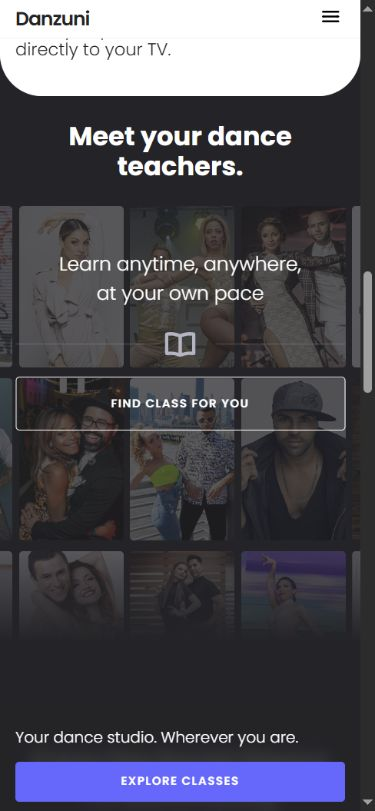
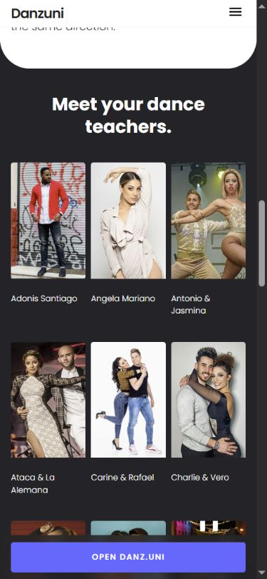

# Danzuni — instructor section art-direction follow-up

2026-09-08. Read-only product review; no application edits or deployment.

The owner values the previous instructor section's overlay CTA and feeling of abundance and discovery. This review compares that composition with the local clarity candidate, not the content accuracy of the instructor catalog.

## Fresh screenshot evidence

Both captures use the same in-app browser tab, a requested 390×844 viewport and the section's existing #instructors anchor. Saved files were opened and visually inspected. Differences in section anchor offsets mean heading positions are not pixel-aligned; this is a section-composition comparison, not an exact layout-diff assertion.

1. **Live production — compact, atmospheric invitation; overlay readability and bottom banner still need care.** Source: https://go.danzuni.com/#instructors

2. **Local candidate — clearer individual identities, but much longer and without an invitation inside the section.** Source: http://127.0.0.1:4184/#instructors

The bottom fixed banner visible in the local screenshot is a separate global CTA; it is not an instructor-section overlay.

## Findings

- At the verified viewport, the production section is 741.75 CSS px tall; the local section is 2050.10 CSS px tall, approximately 2.76 times longer.
- The local DOM contains21 instructor images. Source comparison confirms no portraits were added by the clarity change.
- Production uses a wide7-column,3-row mosaic, cropped at the sides, with dimming, a gradient and an overlaid text/button group.
- The candidate removes `.instructors__cta-block`, removes gradients, raises image opacity, changes mobile to3columns and7rows, and places names below the images.
- These changes improve inspection of individual instructors but change the section's role from a compact invitation to a directory.

## Art-direction decision proposed to the owner

Restore the mosaic and single overlay CTA as the section's composition. Cropped edges and progressive dimming suggest continuation; the central action gives the viewer a way in. Keep enough face visibility and text contrast that the invitation remains accessible. Mystery may come from the imagery, not from concealing the product or the button's destination.

Keep current safeguards: truthful copy without invented catalog counts or monthly-release claims, descriptive alternative text, lazy loading, keyboard focus and the actual app destination. Do not restore the unrelated fixed bottom banner as part of a blanket rollback. Do not add carousel motion or extra cards to compensate.

The existing production mobile positioning fix in `css/danzuni.css` must be preserved if implemented later; blindly restoring archived CSS would miss that fix.

Source corroboration: `scripts/landing-clarity.mjs` removes the overlay; `css/clarity.css` changes the grid, gradients, names and opacity; baseline composition is in `css/style.css`; production fixes and truth constraints remain in `css/danzuni.css` and `scripts/build.mjs`.

## Limits / preservation

This is a visual hierarchy judgment, not a measured conversion improvement. Full contrast, screen-reader behavior, animation and physical-device testing were not performed. No claim is made about the number of actually available lessons or instructors. Audit files are local, uncommitted and unpushed; retain this worktree with its existing unpushed implementation work.
