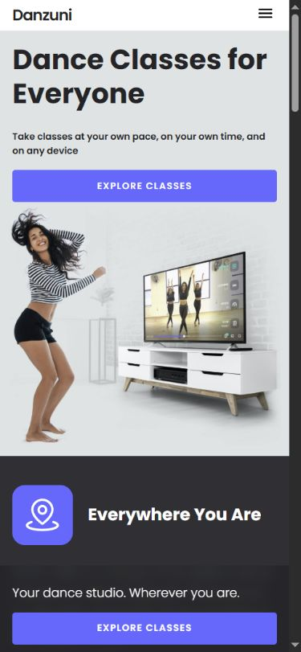
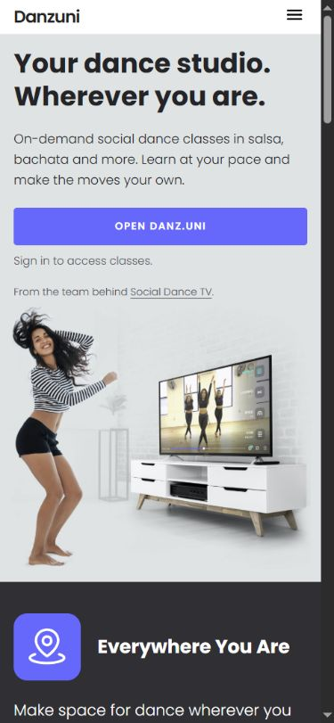
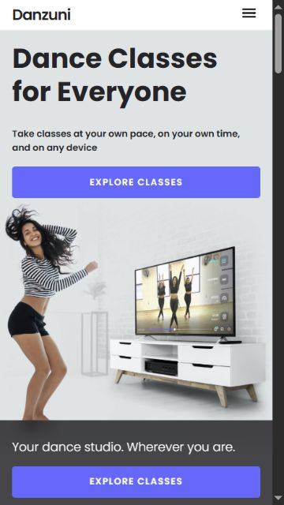
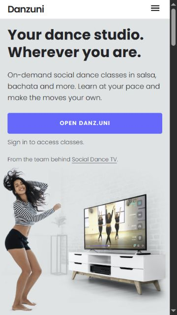

# Danzuni — mobile hero art-direction audit

Date: 2026-09-08. Scope: the first screen only; current production versus the existing local clarity candidate. No application source, production configuration, or deployment was changed for this audit.

## Brand rule

The owner clarified that **Danzuni** is the brand. `danz.uni` is the Instagram handle, not the website or company name. The local candidate's `Open danz.uni` CTA is incorrect. Use `@danz.uni` only when explicitly identifying Instagram.

## Fresh evidence

Both versions were opened sequentially in the same in-app browser tab, at scroll position zero, at the same requested viewport. All four saved screenshots were opened and visually inspected. These are browser viewport checks, not physical-device testing.

Production: https://go.danzuni.com/

Local candidate: http://127.0.0.1:4184/

1. **Production, 390×844 — stronger headline and earlier emotional scene; intrusive bottom banner.** [Screenshot](01-live-390.png)
2. **Local candidate, 390×844 — more readable supporting text and no initial bottom banner; weaker hierarchy and delayed scene.** [Screenshot](02-local-390.png)
3. **Local candidate, 375×667 — supporting material dominates more of the first screen; complete dance scene remains visible near the bottom.** [Screenshot](03-local-375.png)
4. **Production, 375×667 — dance scene arrives earlier, but the fixed banner covers its lower portion.** [Screenshot](04-live-375.png)

| 390×844 production | 390×844 local candidate |
| --- | --- |
|  |  |

| 375×667 production | 375×667 local candidate |
| --- | --- |
|  |  |

## Measured facts

| Measurement | Production | Local candidate |
| --- | --- | --- |
| Headline at 390 viewport | 36 px | 31.232 px |
| Headline at 375 viewport | 36 px | 30.016 px |
| Supporting text typography | 12 px / 18 px, weight 600 | 15 px / 24 px, weight 400 |
| Top of photo container at 390 | 261.675 px | 350.250 px |
| Top of photo container at 375 | 261.675 px | 347.225 px |
| Photo container height | 314 px | 314 px |
| Added material after primary CTA | None | Sign-in note and Social Dance TV origin line |

The photo container starts approximately **89 px later at 390** and **86 px later at 375**. Its CSS background and 314 px container height are unchanged. Container geometry is not a claim that all 314 px are occupied by the subject; the image uses `contain`.

The two new post-button notes, including their margins, add approximately 64 px. The new description occupies three lines rather than two. The headline loses roughly 13–17% of its type size on these mobile widths.

Source corroboration: `scripts/landing-clarity.mjs`, `css/clarity.css`, the unchanged archived `index.html` and `css/style.css`. The source review was independent of the screenshot review.

## Art-direction judgment

The new candidate is not uniformly worse. Hiding the initial fixed banner and enlarging the description improve readability and remove interference. At 375×667 the new version shows the lower dance scene that the production banner obscures. Preserve those improvements.

The regression is the hierarchy above the image: the strongest type is smaller, an explanatory paragraph is longer, and service/provenance notes delay the person and lesson. Preserving the same photograph did not preserve its place or visual weight in the mobile composition.

The concept “Your dance studio. Wherever you are.” still fits the owner's positioning. Do not discard the concept simply because its current mobile execution is weaker. Pair it with a shorter, concrete explanation of online dance classes.

`Open danz.uni` has two problems: the wrong brand spelling and a more utilitarian invitation than `Explore classes`. A conversion-oriented replacement must describe the actual destination. Do not promise a free lesson, immediate playback, registration, or an accessible catalog without separately verifying that path.

The caption about signing in is truthful context, but must remain subordinate and close to the button. The Social Dance TV origin line should not occupy scarce hero space; move the single marketing attribution to the footer, without removing legally required attribution.

## Minimum corrective pass — proposed, not implemented

1. Correct brand spelling to Danzuni in all non-Instagram display text.
2. Keep the two-line studio/anywhere concept. Restore a headline around 34–36 px, validating the exact phrase at 320, 375 and 390 px rather than accepting accidental three-line wrapping.
3. Reduce the subtitle to one concrete sentence, preferably two mobile lines. Keep the improved legibility; do not return to 12 px just to fit more copy.
4. Remove the origin line from the hero. Treat the CTA and its short, truthful sign-in note as one group.
5. Bring the photo earlier by shortening the copy stack. Preserve the person, movement and visible lesson as the scene's essential evidence; avoid a blind crop or a new asset.
6. Keep the initial fixed bottom banner hidden. Do not restore it as part of a wholesale rollback.
7. Do not add new hero animation to compensate for weak composition. Approve the static mobile frame before considering subtle motion.

Acceptance: one clear promise, one brief explanation, one primary action; visibly stronger headline; substantially earlier photo without covering the subject or CTA; no dotted brand name outside Instagram; no unsupported offer or access claims. Keep the palette, imagery, type family and overall atmosphere.

## Limits and preservation

This is an art-direction and DOM-geometry audit, not a conversion experiment, full accessibility certification, performance test, or new-user account-flow verification. Small secondary captions remain a readability consideration; contrast, assistive technology, keyboard navigation and real-device behavior were not comprehensively tested here. No claim is made about animation quality from still screenshots.

Audit files are local and uncommitted. The existing implementation worktree still contains unpushed changes and must be retained. This audit does not authorize or perform merge, deployment, provider activation, payment, email or database changes.
