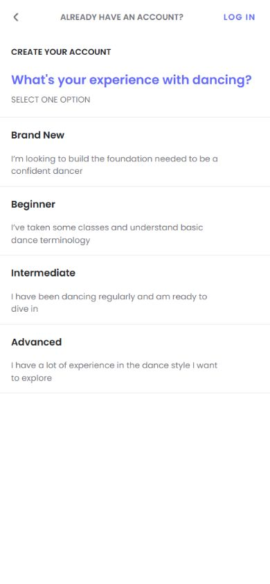
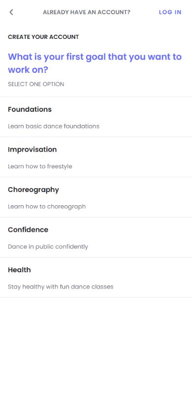
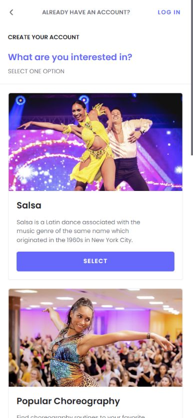
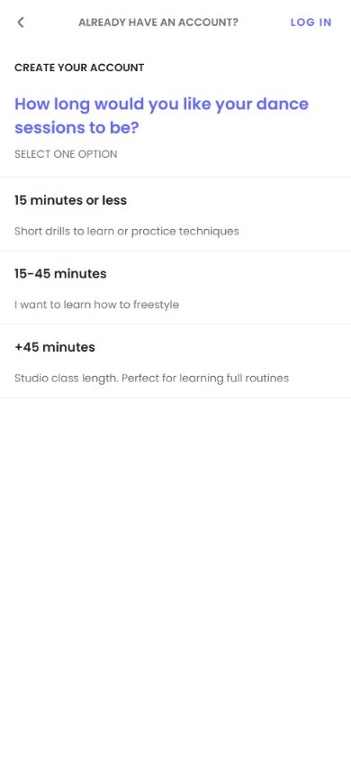
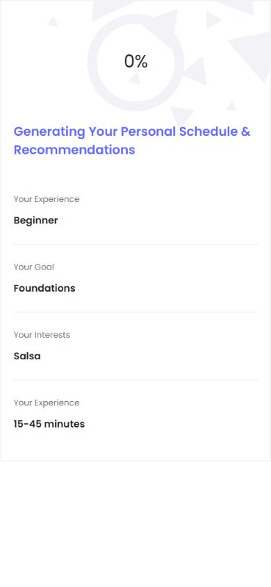
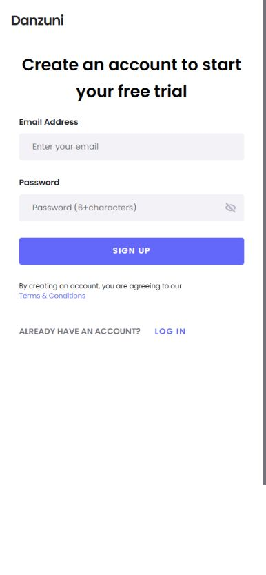
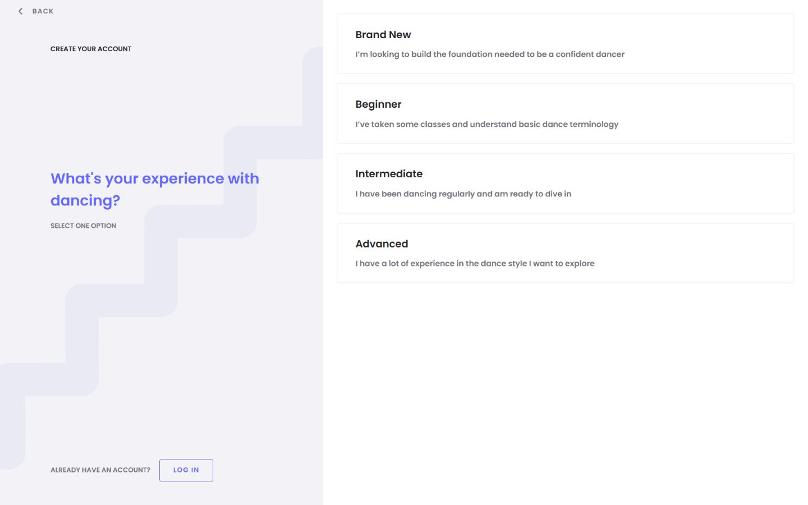

# Danzuni onboarding — observed flow and modernization direction

2026-09-09. Read-only audit, NOT an implemented app change. Product Design Audit: current-run screenshots first, flow inspection, then source/public-bundle corroboration. The separate landing release only changes entry links and approved hero layout; it does not deploy this onboarding proposal.

## What was actually tested

In-app browser, 390 × 844 CSS viewport. Chose Beginner → Foundations → Salsa → 15–45 minutes. Clicked Next through four questions, observed timed recap and email/password form. No email/password entered, account created, registration request submitted, subscription purchased or provider flag changed. Test answers existed only in the SPA; a fresh navigation to /signup/5 reset to the first question. Desktop 1440 × 900 screenshot documents that reset, not a completed desktop recap.

Saved screenshots were opened and visually inspected. Rejected the first styles capture while background images were still loading; retained the later fully loaded capture. These are browser screenshots, not proposed designs.

| Step | Observed surface | Health and highest-impact issue |
| --- | --- | --- |
| 1 | Experience | Choices understandable, but no step count; no visible Next until selection; back/reset and keyboard issues confirmed in public bundle. |
| 2 | Goal | Clear choices, but long question and identical form-like presentation; no sense of distance to completion. |
| 3 | Interests | Real dance photography adds life; 2270px document at mobile width makes it unnecessarily long. Shared instruction says one choice despite multi-select implementation. |
| 4 | Session length | Useful short choice, but middle description incorrectly discusses freestyle. |
| 5 | Circular recap | Summarizes actual answers, but timer simulates generation; duration incorrectly labelled experience, no immediate Continue or edit action. |
| 6 | Account | Clear email/password action; headline promises a free trial without showing terms/outcome here. Actual trial availability not verified; do not invent it. |

## Captured evidence

## Recommended order, without a full redesign

1. **Functional foundation:** keep answers on Back and refresh, correct category-specific checked state, restore keyboard-operable native inputs, fix duration label/description and multi-select instruction. Keep existing registration payload, API and access gates. Persist only non-sensitive survey fields in versioned session storage if used, never credentials or tokens.
2. **Orientation and rhythm:** four segments with a visible `Question 2 of 4 · Your goal`; same shell, stable Continue area and back affordance. Indicate account creation follows the questions. Shorter question copy and compact style choices using the existing photography. Preserve an easy `I'm not sure yet` option.
3. **One restrained motion language:** selected state settles in roughly 160–200ms; question content crossfades/slides only 8–12px over 200–280ms; progress fills after a real completed answer, not elapsed time. These are proposed starting parameters, not measured optimums. No bouncing, looping glow, orbiting text or mandatory delay.
4. **Final screen: review, not simulated computation.** Keep the circular motif only if it represents the four completed answers. Briefly reveal four segments/answers, around 600–900ms total, with `Create my account` available immediately. Let the user edit each answer. Possible neutral title: `Your dance preferences, together.` No unsupported claim that a personal schedule has been generated. If real async work is added later, tie progress to it and provide real errors/retry.
5. **Registration truth:** resolve what account creation actually grants before changing the trial promise. Do not add prices, trial duration, card requirements or automatic-renewal claims without confirmed terms.

## Accessibility and motion acceptance

Respect `prefers-reduced-motion`: instant final layout with the same information/actions, no artificial wait. Keep a semantic heading per question, real radio/checkbox group labels, visible keyboard focus, named Back control and focus management after navigation. Do not use percent text as a substitute for an accessible status. These recommendations follow [W3C motion guidance](https://www.w3.org/WAI/WCAG22/Understanding/animation-from-interactions.html) and [MDN reduced-motion documentation](https://developer.mozilla.org/en-US/docs/Web/CSS/Reference/At-rules/@media/prefers-reduced-motion).

## Evidence limits / next gate

No conversion measurement, screen-reader certification, physical-device test, full registration/email/access test, or live backend recommendation verification. [Source review](source-review.md) distinguishes confirmed live public JS/CSS from source-only backend findings and records precise hashes/paths. The final circle currently uses fixed timer increments; the public bundle independently confirms this. Do not equate that with proof of personalized recommendations.

Next implementation should be an isolated Learn frontend change, preceded by a selected visual treatment for the revised recap; Preview and separate app-release approval are required. The owner asked to think through modernization, not to deploy this application redesign in the landing release.

## Owner clarification after audit

Preserve the four questions before account creation and the circular completion moment: it intentionally reflects effort already invested and connects the answers to the next account action. Do not remove the circle or move account collection before the questions. Recommended refinement is a polished four-answer assembly around the centre, followed by a completed ring and `Your dance preferences are ready`. This represents actual completed answers, not unsupported schedule generation. Keep answers readable and the next action usable; measure questionnaire-to-registration completion rather than assume the animation increases it. This clarification supersedes the earlier optional-circle phrasing above; no app implementation or release occurred in this audit.
